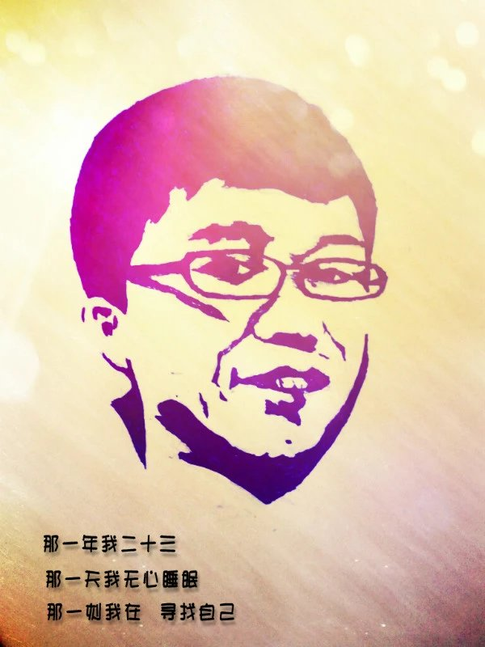

# 自画像
*2013-1-30，北京，刚爬完长城*
******

 
有时候,觉得自己一无所有,仿佛被世界抛弃； 
有时候,明明身边很多朋友,却依然觉得孤单; 
有时候,走过熟悉的街角,看到熟悉的背影,突然想起一个人; 
有时候,夜深人静时,觉得寂寞深入骨髓; 
有时候,突然很想哭,却难过的哭不出来; 
有时候,我也会 突然见找不到自己...... 
 
那一年我二十三 
那一天我无心睡眠 
那一刻我在 寻找自己 ..... 
 

