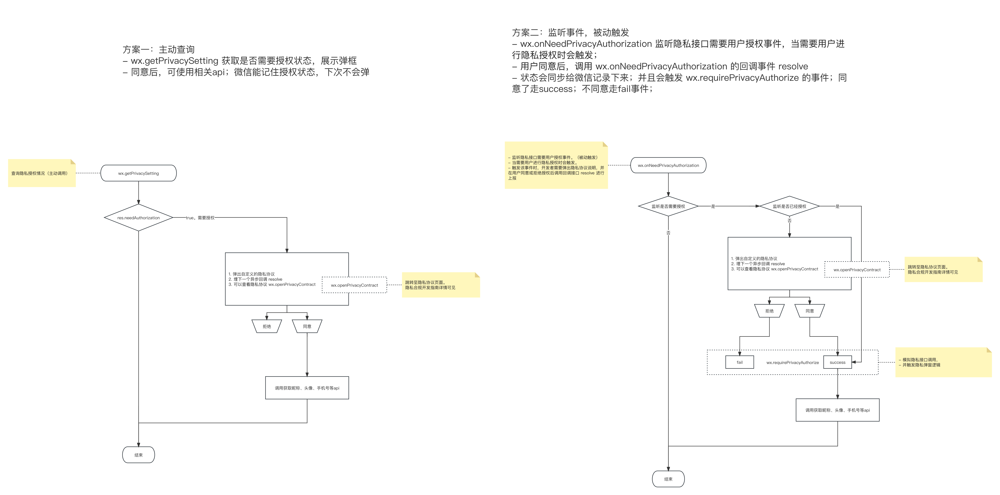

# 一张图搞懂隐私协议

**这是那个引起开发同学摔盆砸碗的公告**
[原文地址](https://developers.weixin.qq.com/community/develop/doc/00042e3ef54940ce8520e38db61801?blockType=1)
```
为规范开发者的用户个人信息处理行为，保障用户的合法权益，自2023年9月15日起，对于涉及处理用户个人信息的小程序开发者，微信要求，仅当开发者主动向平台同步用户已阅读并同意了小程序的隐私保护指引等信息处理规则后，方可调用微信提供的隐私接口。
```

**这是开发同学需要特别关注的事项：**
1. 在 2023年9月15号之前，在 app.json 中配置 __usePrivacyCheck__: true 后，会启用隐私相关功能，如果不配置或者配置为 false 则不会启用。
2. 在 2023年9月15号之后，不论 app.json 中是否有配置 __usePrivacyCheck__，隐私相关功能都会启用。

## 撒疼
这里省略一万句脏话
撒疼，看完公告，只感受到了：时间紧，任务重；具体咋搞？不知道，看不懂，一脸懵逼

*图在最下面，中间有很多废话，如果看官猴急，可以直接翻到最下面*

## 必须要看的 2 篇文章；
官方的，都是官方的，统统都是官方提供的

不知道怎么填写隐私协议，看这里：[用户隐私保护指引设置](https://developers.weixin.qq.com/miniprogram/dev/framework/user-privacy/)

想查看隐私接口与对应的处理的信息关系，点这里：[小程序用户隐私保护指引内容介绍](https://developers.weixin.qq.com/miniprogram/dev/framework/user-privacy/miniprogram-intro.html)


## 必须要知道的 4 个Api；
- wx.getPrivacySetting 查询隐私授权情况[官方链接](https://developers.weixin.qq.com/miniprogram/dev/api/open-api/privacy/wx.getPrivacySetting.html)
- wx.onNeedPrivacyAuthorization 监听隐私接口需要用户授权事件。 [官方链接](https://developers.weixin.qq.com/miniprogram/dev/api/open-api/privacy/wx.onNeedPrivacyAuthorization.html)
- wx.openPrivacyContract 跳转至隐私协议页面 [官方链接](https://developers.weixin.qq.com/miniprogram/dev/api/open-api/privacy/wx.openPrivacyContract.html)
- wx.requirePrivacyAuthorize 模拟隐私接口调用，并触发隐私弹窗逻辑 [官方链接](https://developers.weixin.qq.com/miniprogram/dev/api/open-api/privacy/wx.requirePrivacyAuthorize.html)


##### # wx.getPrivacySetting(Object object) 
``` js
// # 查询隐私授权情况 #
wx.getPrivacySetting({
  success: res => {
    console.log(res)
    // 返回参数示例
    // {
    //   errMsg: "getPrivacySetting:ok"
    //   needAuthorization: true // 是否需要用户授权隐私协议（如果用户之前授权过则会返回false，如果用户还没授权过则返回true，如果用户之前授权过、但后来小程序又新增了隐私收集类型也会返回true）
    //   privacyContractName: "《xxUAT小程序隐私保护指引》" //隐私授权协议的名称
    // } 
  }
})
```
##### # wx.onNeedPrivacyAuthorization
```js
// # 监听隐私接口需要用户授权事件 #
/**
 * - 监听隐私接口需要用户授权事件
 * - 当需要用户进行隐私授权时会触发
 * - 触发该事件时，开发者需要弹出隐私协议说明，并在用户同意或拒绝授权后调用回调接口 resolve 进行上报
 */
wx.onNeedPrivacyAuthorization(resolve => {
  // 需要用户同意隐私授权时
  // 弹出开发者自定义的隐私授权弹窗
  this.setData({
    showPrivacy: true
  })
  this.resolvePrivacyAuthorization = resolve
})
```
##### # wx.openPrivacyContract
```js
// # 跳转至隐私协议页面 #
wx.openPrivacyContract({
  success: (res) => {  // 打开成功
    console.log("openPrivacyContract - success", res)
    // 返回参数示例
    // {
    //   errMsg: "openPrivacyContract:ok"
    // }
  },
  fail: () => {}, // 打开失败
})
```

##### # wx.requirePrivacyAuthorize

```js
// # 模拟隐私接口调用，并触发隐私弹窗逻辑 #
wx.requirePrivacyAuthorize({
  success: () => {
    // 用户同意授权
    // 继续小程序逻辑
  },
  fail: () => {
    // 用户拒绝授权
  },
})
```

## 一看就明白的流程图
可以查看大图，更清晰哦；



## 一看就会，一做就废

**代码写好了，工具上就是不展示协议？**
*升级开发者工具,基础库版本调整到 3.0.1*

**如果想要代码，私信我** *说话温柔点，可以手把手教你*
