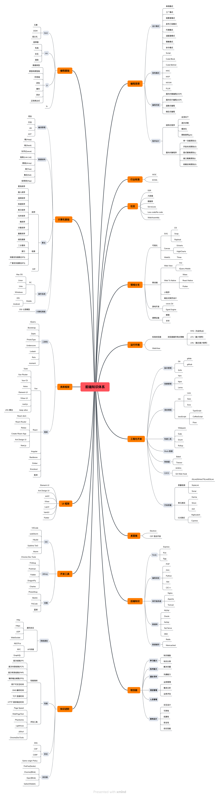

# 前端知识体系


先看看下面的知识点，你懂的多少？

```
## 掌握基础知识：
HTML 和 CSS： 学会构建页面结构和样式。
JavaScript： 学习基本语法、DOM 操作、事件处理等。

## 深入学习 JavaScript：
ES6+ 特性： 理解现代 JavaScript 的新特性。
异步编程： 熟悉 Promise、async/await 等异步编程概念。
闭包和作用域： 深入理解 JavaScript 的作用域和闭包机制。

## 学习前端框架和库：
React、Vue 或 Angular： 选择一到两个主流框架学习。
状态管理： 学习 Redux、Vuex 等状态管理工具。
路由管理： 学会使用前端路由。

## 掌握构建工具和包管理器：
Webpack： 学习打包工具的使用。
npm 或 Yarn： 学习包管理器的基本操作。

## 深入研究 CSS：
CSS 预处理器： 学习 Sass 或 Less 等预处理器。
响应式设计： 掌握响应式设计的原理和实践。

## 学习版本控制：
Git： 学会使用 Git 进行版本控制。

## 了解浏览器工作原理：
DOM 和渲染树： 了解浏览器是如何构建 DOM 和渲染页面的。
性能优化： 学会优化页面性能，包括减小加载时间和减小渲染时间。

## 学习测试和调试工具：
单元测试： 学会编写和运行单元测试。
调试工具： 使用浏览器的开发者工具进行调试。

## 掌握 HTTP 和网络请求：
HTTP 协议： 了解 HTTP 请求和响应的过程。
AJAX 和 Fetch： 学习异步请求的方法。

## 学习 Node.js 和后端知识：
Node.js： 了解如何使用 Node.js 进行服务器端开发。
Express 或 Koa： 掌握常用的 Node.js 框架。

## 持续学习和实践：
阅读文档： 学会阅读官方文档，了解框架和工具的最新特性。
项目实践： 通过实际项目锻炼自己的技能。

## 参与社区和开源项目：
GitHub： 参与开源项目，学习他人的优秀代码。
技术社区： 加入技术社区，与其他开发者交流。

最后的最后
了解前端领域的最新技术趋势, 不断优化自己的工作流和代码质量
```

看完后，你是不是都已经掌握了？

你是否知道自己还需要掌握哪些知识？ 

你对前端的整体体系是否了解？

你对自己的知识体系是否有正确的认识？

来自灵魂的拷问，是否已经把自己问到？

那你那不赶快把下面的文档下载下来；对比着梳理出自己的知识体系，整理出自己的学习路线，循循渐进查缺补漏，不断提升自己的能力，不断提升自己的价值（卟铃卟铃，¥的味道）

希望对你有所帮助，祝君早日晋级；

