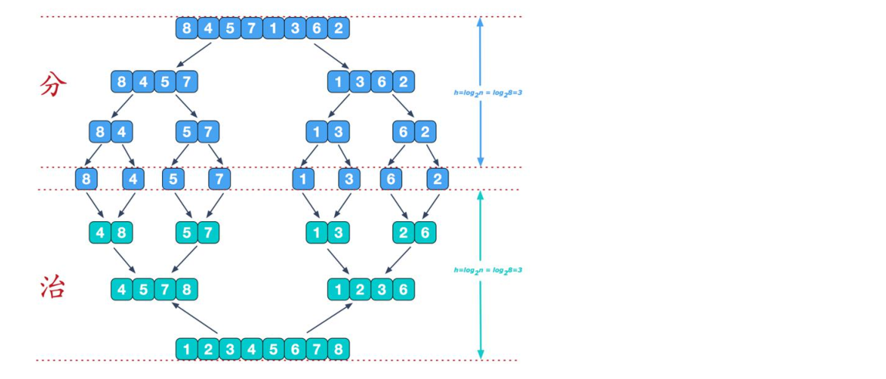

# 归并排序

归并排序是建立在归并操作上的一种<b style="color:#FF3399">有效，稳定的</b>排序算法；

该算法是采用分治法的一个非常典型的应用。将已有序的子序列合并，得到完全有序的序列；

划重点：将<b style="color:#FF3399">已有序</b>的子序列合并； *即先使每个子序列有序，再进行合并*；


### 一张图，带你看清细节


开头就讲，归并，归并，是将两个有序的序列合并；但是我们要排序的集合，往往是“乱七八糟”的无序集合；*话说回来，如果有序了，还排什么序呀？*
所以是先分，后治


### 一起动手，丰衣足食
**分**，将n个元素分成个含n/2个元素的子序列，（不要问我，不能等分怎么办，向上取整/向下取整全看你的心情，一路分到最后，肯定是一个一个到最小单位）
```js

/**
 * 分解
 * 将n个元素分成个含n/2个元素的子序列。
 * 递归，直至最小颗粒
 */
function arrSlice(arr){
  if(arr.length <= 1) return arr;

  const middle = Math.floor(arr.length / 2); // 计算数组的中间位置
  const leftHalf = arr.slice(0, middle); // 切割出左半部分
  const rightHalf = arr.slice(middle); // 切割出右半部分
  console.log("slice-left", leftHalf);
  console.log("slice-right", rightHalf);

  const leftSort = arrSlice(leftHalf);
  const rightSort = arrSlice(rightHalf);

  return [...leftSort, ...rightSort]; // 返回包含两个切割后数组的数组
}

let arr =[520, 250,  1314, 521, 5, 2, 0, 13, 14];
let result = arrSlice(arr);
console.log(result);

// log
// slice-left [ 520, 250, 1314, 521 ]
// slice-right [ 5, 2, 0, 13, 14 ]
// slice-left [ 520, 250 ]
// slice-right [ 1314, 521 ]
// slice-left [ 520 ]
// slice-right [ 250 ]
// slice-left [ 1314 ]
// slice-right [ 521 ]
// slice-left [ 5, 2 ]
// slice-right [ 0, 13, 14 ]
// slice-left [ 5 ]
// slice-right [ 2 ]
// slice-left [ 0 ]
// slice-right [ 13, 14 ]
// slice-left [ 13 ]
// slice-right [ 14 ]
```


**治**，合并两个已排序的子序列已得到排序结果

```js


/** 合并
 *  合并两个已排序的子序列已得到排序结果
 */
function arrMerge(left, right) {
  console.log("merge-left:", left);
  console.log("merge-right:", right);
  let resultArray = [];
  let i = 0;
  let j = 0;

  while(i < left.length && j < right.length) {
    console.log("i-j:", i +"-" + j + "  L-R:" + left[i] +"-" + right[j]);
    if (left[i] < right[j]) {
      resultArray.push(left[i]);
      i++;
    } else {
      resultArray.push(right[j]);
      j++;
    }
  }

  // 返回时候，要切记遗漏的最后一个数字
  return resultArray.concat(left.slice(i), right.slice(j));
}

let arrL =[1, 3, 5, 7, 9];
let arrR = [ 2, 4, 6, 8]
let result = arrMerge(arrL, arrR);
console.log('result:', result);

// 当传入的数组是有序的时候
// merge-left: [ 1, 3, 5, 7, 9 ]
// merge-right: [ 2, 4, 6, 8 ]
// i-j: 0-0  L-R:1-2
// i-j: 1-0  L-R:3-2
// i-j: 1-1  L-R:3-4
// i-j: 2-1  L-R:5-4
// i-j: 2-2  L-R:5-6
// i-j: 3-2  L-R:7-6
// i-j: 3-3  L-R:7-8
// i-j: 4-3  L-R:9-8
// result: [ 1, 2, 3, 4, 5, 6, 7, 8, 9 ]


let arrL =[1,3,7,9,5];
let arrR = [ 2,4,6,8]
let result = arrMerge(arrL, arrR);
console.log('result:', result);

// 当传入的数组是错乱无序的时候
// merge-left: [ 1, 3, 7, 9, 5 ]
// merge-right: [ 2, 4, 6, 8 ]
// i-j: 0-0  L-R:1-2
// i-j: 1-0  L-R:3-2
// i-j: 1-1  L-R:3-4
// i-j: 2-1  L-R:7-4
// i-j: 2-2  L-R:7-6
// i-j: 2-3  L-R:7-8
// i-j: 3-3  L-R:9-8
// [ 1, 2, 3, 4, 6, 7, 8, 9, 5]
```

### 成品区
分解动作完成后，就是连贯动作：

```js

/**
 * 归并排序
 * 原理是用分治思想，分治模式在每一层递归上有三个步骤：
 * 分解（Divide）：将n个元素分成个含n/2个元素的子序列。
 * 解决（Conquer）：用合并排序法对两个子序列递归的排序。
 * 合并（Combine）：合并两个已排序的子序列已得到排序结果
 */

/**
 * 分解
 * 将n个元素分成个含n/2个元素的子序列。
 */
function arrSlice(arr){
  if(arr.length <= 1) return arr;
  console.log("arr", arr);

  const middle = Math.floor(arr.length / 2); // 计算数组的中间位置
  const leftHalf = arr.slice(0, middle); // 切割出左半部分
  const rightHalf = arr.slice(middle); // 切割出右半部分
  console.log("slice-left", leftHalf);
  console.log("slice-left", rightHalf);

  const leftSort = arrSlice(leftHalf);
  const rightSort = arrSlice(rightHalf);

  return arrMerge(leftSort, rightSort); // 返回包含两个切割后数组的数组
}


/** 
 * 合并
 * 合并两个已排序的子序列已得到排序结果
 */
function arrMerge(left, right) {
  console.log("merge-left:", left);
  console.log("merge-right:", right);
  let resultArray = [];
  
  let i = 0
  let j = 0;

  while(i < left.length && j < right.length) {
    console.log("i-j:", i +"-" + j);
    if (left[i] < right[j]) {
      resultArray.push(left[i]);
      i++;
    } else {
      resultArray.push(right[j]);
      j++;
    }
  }
  
  return resultArray.concat(left.slice(i), right.slice(j));
}

let arr = [34, 25, 64, 12, 22, 45, 11, 90, 9];
// let arr = [34, 25, 50, 9];
// const sortedArray = arrSort(arr);
// console.log(sortedArray);

const sortResult = arrSlice(arr)
console.log("sortResult", sortResult);
```

