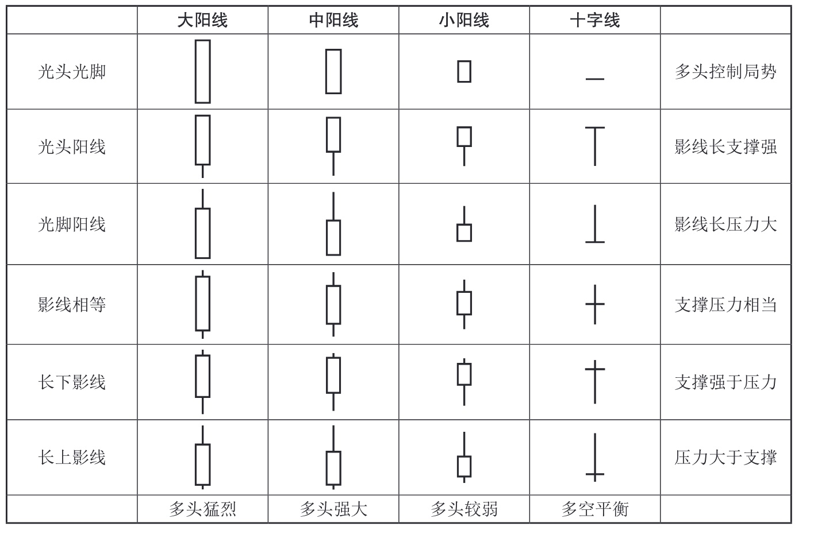
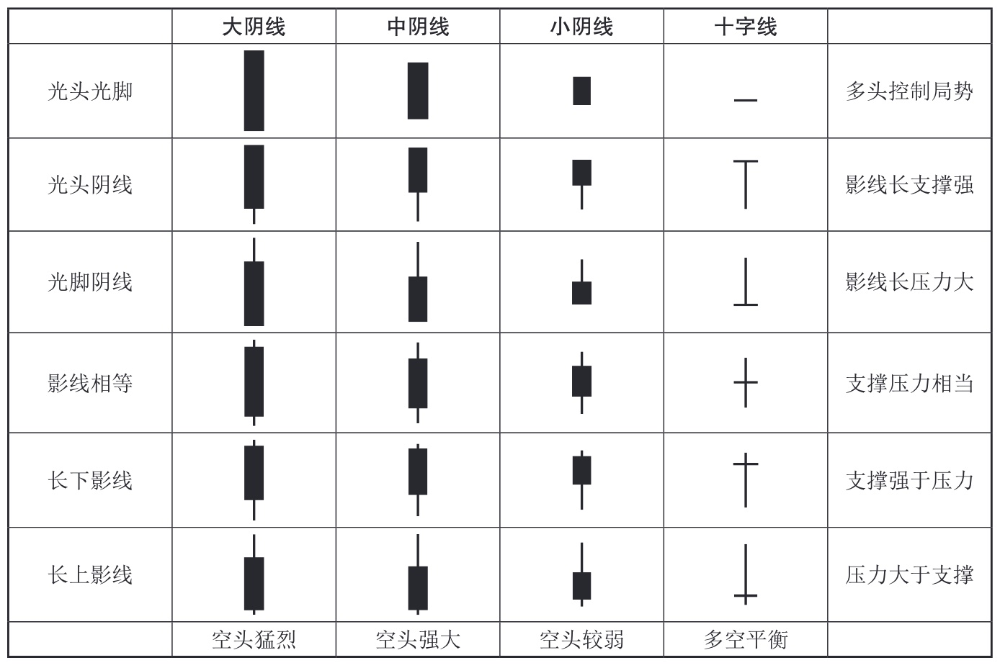
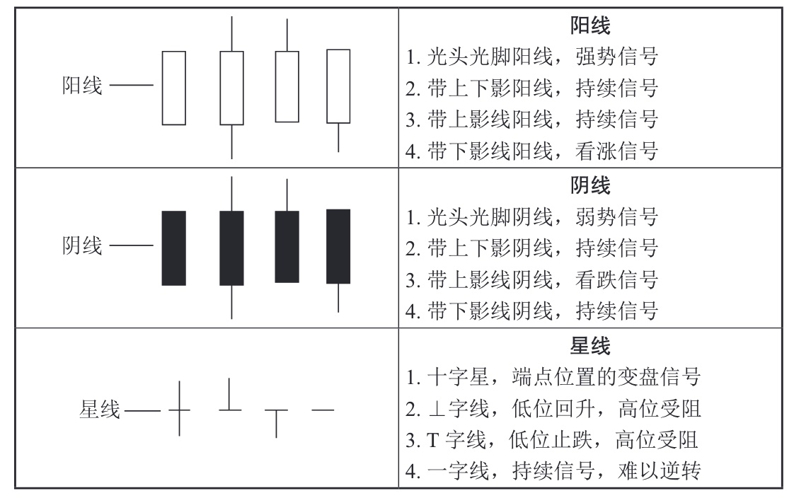
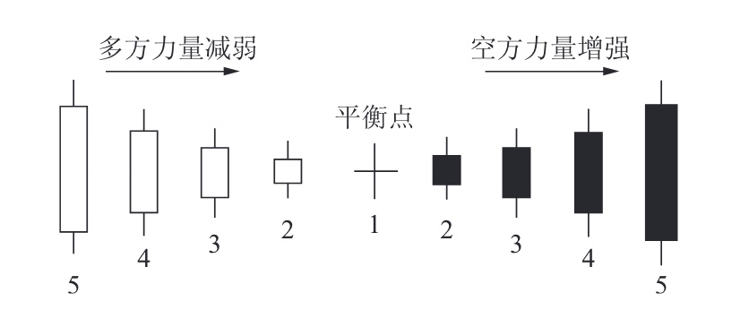

# K线图（或蜡烛图）
K线图起源于日本德川幕府时代，最初由米商用于记录米价的涨跌。后来，这种图表形式被引入股市和期货市场，并在东南亚地区流行开来

## 重点是反映过去市场价格走势的图表工具
- 是对过去走势的记录
- 可以用来预测未来趋势

### K线图的组成
- 实体：表示开盘价与收盘价之间的价差，通常用红色表示阳线（收盘价高于开盘价），黑色或绿色表示阴线（收盘价低于开盘价）
- 上影线：连接最高价与实体顶部，表示当日最高价
- 下影线：连接最低价与实体底部，表示当日最低价

    <!-- 上影线 -->
    

    

    <!-- 实体 -->
    

    

    <!-- 高价标注 -->
    

      高价
    

    <!-- 低价标注 -->
    

      低价
    

    <!-- 上影线标注 -->
    

      上影线
    

    <!-- 下影线标注 -->
    

      下影线
    

/*K线还可以根据形态分为阳线、阴线和同价线，以及更细分的形态如十字星、锤头线、倒锤头线等*/

| 类型 | 理解 | 趋势 |
|:------:|:------:|:------:|
|   阳线 | 收盘价高于开盘价，以红色或白色空心柱体表示| 多头信号，  在涨势中，继续看涨，或加速上涨，  在跌势中，有止跌回升或反转上涨作用 |
|  阴线   | 收盘价低于开盘价，以黑色或白色实心柱体表示 |空头信号，  在涨势中，有止涨回退或反转下跌作用，  在跌势中，继续看跌，或加速下跌 |
| 平价线 | 收盘价等于开盘价 |变盘、调整信号， 在涨势中，意味上涨趋势将放缓，股价存在回调的可能， 在跌势中，有止跌企稳意义 |
| 单影线| 只有一条上影线或下影线的 K 线，就叫单影线 ||
| 双影线| 既有上影线又有下影线的 K 线，叫双影线 | 通常出现在上有压力、下有支撑的震荡行情之中|

/*根据时间周期的不同，K线图可以分为日K线、周K线、月K线、年K线等*/

    <!-- 上影线 -->
    

    <!-- 实体 -->
    

    <!-- 标注 -->
    
阳线

    <!-- 上影线 -->
    

    <!-- 实体 -->
    

    <!-- 标注 -->
    
阴线

    <!-- 上影线 -->
    

    <!-- 实体 -->
    

    <!-- 标注 -->
    
平价线

## 平价线之一字线

    <!-- 上影线 -->
    

    <!-- 实体 -->
    

    <!-- 标注 -->
    
一字线

一字线。在涨、跌停板制度下，一字线有重大意义。 
在上涨趋势中出现的一字线，表示股价封在涨停板价上，说明此时多方力量强大，日后股价往往会成为强势股。如果该股一连出现多个上涨一字线，从避免短期风险出发<b>不宜继续追涨</b> 
如果在下趋势中出现一字线，表示股价封杀在跌停价位上，说明此时空头力量极其强大，日后此股往往会成为弱势股 
通常在跌势中出现一字线后，股价继续下跌的可能性很大，但要注意如果该股已经连续出现几个下跌一字线，就不宜再继续杀跌，可在股价反弹时再出局。 /*是个机会*/

## 平价线之 T 字线

    <!-- 上影线 -->
    

    <!-- 实体 -->
    

    <!-- 标注 -->
    
T 字线

    <!-- 上影线 -->
    

    <!-- 实体 -->
    

    <!-- 标注 -->
    
T 字线

    <!-- 上影线 -->
    

    <!-- 实体 -->
    

    <!-- 标注 -->
    
T 字线

T 字线。它的形态特征为：开盘价、收盘价、最高价相同，K 线中只有下影线； 
即使有上影线，也是很短的，可以忽略。 
T 字线转势信号强弱与下影线成正比，下影线越长，则信号越强。

## 平价线之 ⊥ 字线

    <!-- 上影线 -->
    

    <!-- 实体 -->
    

    <!-- 标注 -->
    
⊥ 字线

    <!-- 上影线 -->
    

    <!-- 实体 -->
    

    <!-- 标注 -->
    
⊥ 字线

⊥字线。其形态特征为：开盘价、收盘价、最低价相同，K 线中只有上影线； 
即使有下影线，也是很短的，可以忽略。 
⊥字线转势信号强弱与上影线成正比，上影线越长，则信号越强

## 有24 阳，亦有24阴
在股价走势图表中，各种各样的 K 线形态看起来繁杂零乱。其实，归纳起来一共只有 24 种不同的阳线和 24 种不同的阴线

24 种不同的阳线

24 种不同的阴线

从性质上讲，K 线只有阴线和阳线之分，物质世界在阴阳二气作用下发展变化着，股市在阴阳 K 线的不断交替下出现涨跌走势，所以阴阳 K 线是 K 线操盘术的两大基本元素，
也是股市分析的主干。

## 有 12 种基本图形

根据 K 线形态，可以分为阳线、阴线和同价线（也称星线）三大类，其有 12种基本图形，如表所示。 
收盘价高于开盘价时为阳线， 
收盘价低于开盘价时为阴线， 
收盘价等于（或接近）开盘价即两者处于同一个价位时为同价线或星线。 
同价线或星线根据其影线的长短不同，可以分为十字线、⊥字线、T 字线和一字线四种 

## 阴阳走势变化
根据开盘价和收盘价的波动范围，可将阳线按其实体大小不同分为大阳线、中阳线、小阳线、小星线（极阳线）四种。阴线亦然，可以分为大阴线、中阴线、小阴线、小星线（极阴线）四种。阳线与阴线如图

